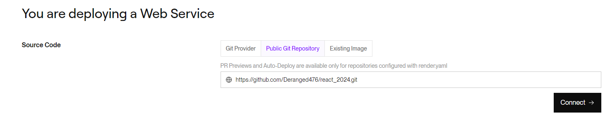
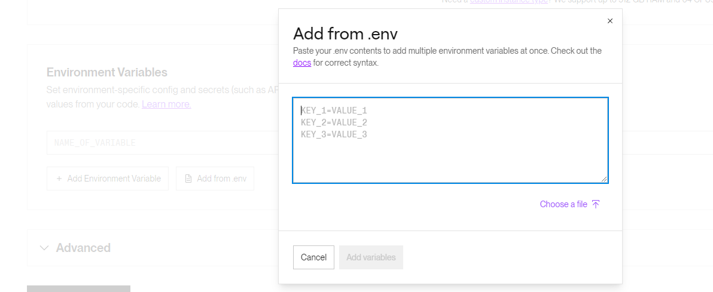

## Sovelluksen siirto renderiin (Web Service)

### **1. Luo uusi web service**

Valitaan Public Git Repository nodeprojektin lähdekoodin lähteeksi ja liitetään github repositorio siihen.

<a href="https://github.com/Deranged476/react_2024/tree/main">Repositorio</a>

    https://github.com/Deranged476/react_2024.git

Language

    node

Root Directory

    frontend/

Build Command

    npm install --prefix ./../backend/ && npm install && npm run build

Start Command

    node ../backend/server.js

Lisätään ympäristömuuttujat .env tiedostosta

.env tiedoston sisältö

    PORT=5000
    MONGODB_URI=mongodb+srv://<db_username>:<db_password>@cluster0.ff9bnq3.mongodb.net/hallinta?retryWrites=true&w=majority&appName=Cluster0
    JWT_SECRET_KEY=<secret_key>

## Sovelluksen siirto renderiin (Docker)

### **1. Luo uusi web service**

Valitaan Public Git Repository nodeprojektin lähdekoodin lähteeksi ja liitetään github repositorio siihen.

<a href="https://github.com/Deranged476/react_2024/tree/main">Repositorio</a>

    https://github.com/Deranged476/react_2024.git

Language

    docker

Lisätään ympäristömuuttujat .env tiedostosta

.env tiedoston sisältö

    PORT=5000
    MONGODB_URI=mongodb+srv://<db_username>:<db_password>@cluster0.ff9bnq3.mongodb.net/hallinta?retryWrites=true&w=majority&appName=Cluster0
    JWT_SECRET_KEY=<secret_key>

## Sovelluksen siirto al 2023 instanssille

### **1. Lisää aws:än security group uusi inbound rule, joka sallii portin 5000 tcp-protokollalla**

### **2. Tiedostojen siirto palvelimelle (githubin main-branch)**

    /var/www/react_2024

### **3. .env tiedoston luonti backend kansioon**

    PORT=5000

&nbsp;

    MONGODB_URI=mongodb+srv://<käyttäjä>:<salasana>@cluster0.ff9bnq3.mongodb.net/hallinta?retryWrites=true&w=majority&appName=Cluster0

&nbsp;

    JWT_SECRET_KEY=<salainenavain>

### **4. Asenna noden moduulit**

    cd /var/www/react_2024/backend

&nbsp;

    npm install

&nbsp;

    cd ../frontend

&nbsp;

     npm install

### **5. Tee react build**

    cd /var/www/react_2024/frontend

&nbsp;

    npm run build

### **6. Http:n (port 80) käyttöönotto (jos haluat käyttää pelkästään nodea)**

    sudo dnf install iptables

Redirect rulen käyttöön ottaminen:

    sudo iptables-nft -t nat -A PREROUTING -i enX0 -p tcp -m tcp --dport 80 -j REDIRECT --to-ports 5000

Redirect rulen poistaminen:

    sudo iptables-nft -t nat -D PREROUTING -i enX0 -p tcp -m tcp --dport 80 -j REDIRECT --to-ports 5000

### **7. Buildin tekeminen /var/www/html kansioon (jos hauat käyttää sekä apachea, että nodea)**

Muutetaan package json skripteistä build skriptiä. Oletetaan että projekti on sijoitettu /var/www/ -kansioon

    "build": "BUILD_PATH='../html/build/' react-scripts build",

### **8. Httpd kofiguraation muuttaminen (jos haluat käyttää sekä apachea, että nodea)**

Jotta palvelin pystyy jakamaan react-buildia juuresta ja api pyynnöt ohjataan noden backendille.

Avataan httpd:en conf tiedosto nano editorilla:

    sudo nano /etc/httpd/conf/httpd.conf

Lisätään tiedoston loppuun heti rivin EnableSendfile on jälkeen tekstit:

    <VirtualHost *:80>
        ServerName < palvelimen ip >
        DocumentRoot /var/www/html/build

        <Directory "/var/www/html/build">
            AllowOverride All
            Require all granted
        </Directory>

        # Proxy requests to backend
        ProxyPass /api/ http://localhost:5000/api/
        ProxyPassReverse /api/ http://localhost:5000/api/
    </VirtualHost>

Muista muuttaa < palvelimen ip > paikalle palvelimen ip.

Kun saat tekstin lisättyä, niin voit tallentaa painamalla ctrl + s ja poistua ctrl + x.

Lopuksi käynnistetään palvelin uudestaan:

    sudo systemctl restart httpd

### **9. Reactin routerin toiminnan parannus (jos haluat käyttää sekä apachea, että nodea)**

Jotta reactin routerin url osoitteet toimisivat palvelimellamme oikein, niin palvelimen tulee jakaa index.html (reactin käynnistys piste) kun siltä sivun react-sivun url:lää.

Ennen vaiheen aloittamista kannattaa tarkistaa onko vaiheen 8 konfiguraatiot asetettu ohjeen mukaisesti.

Aloitetaan luomalla .htaccess -tiedosto /var/www/html/build/ -kansioon:

    sudo nano /var/www/html/build/.htaccess

Tiedoston sisällöksi voidaan laittaa:

    RewriteEngine on

    RewriteCond %{REQUEST_FILENAME} !-f
    RewriteCond %{REQUEST_FILENAME} !-d
    RewriteRule ^.*$ index.html [L]

Kun saat tekstin lisättyä, niin voit tallentaa painamalla ctrl + s ja poistua ctrl + x.

Lopuksi käynnistetään palvelin uudestaan:

    sudo systemctl restart httpd

### **10. Käynnistys (valinnainen)**

Käynnistys projekti kansiosta

    cd /var/www/react_2024/backend

&nbsp;

    npm start

Käynnistys projekti kansion ulkopuolelta

    npm start --prefix /polku/projekti/kansioon/

### ** duckdns ja backend scriptien käynnistys palvelimen käynnistyksen yhteydessä**

Jotta sinun ei tarvitse joka kerta palvelimen käynnistyttyä uudelleen käynnistää duckdns ja backend scriptejä me voidaan tehdä palvelut, jotka käynnistävät nämä scriptit meidän puolesta kun ne laitetaan käynnistymään startupin yhteydessä.

Noden käynnistys scriptin luonti:

    sudo nano /usr/sbin/node_daemon.sh

Liitä tiedostoon tekstit:

    #!/bin/bash
    su - ec2-user -c "nohup npm start --prefix /var/www/react2024/backend/ > /var/www/react2024/backend/node.log &"

Duckds käynnistys scriptin luonti:

    sudo nano /usr/sbin/duck_damon.sh

Liitä tiedostoon tekstit:

    [Unit]
    Description=systemd service unit file for running duckdns script.

    [Service]
    ExecStart=/bin/bash /usr/sbin/duck_daemon.sh

    [Install]
    WantedBy=multi-user.target

Node palvelun luonti:

    sudo nano /etc/systemd/system/appbackend.service

Liitä tiedostoon tekstit:

    [Unit]
    Description=systemd service unit file for starting user-management-app backend on boot.

    [Service]
    ExecStart=/bin/bash /usr/sbin/appbackend.sh

    [Install]
    WantedBy=multi-user.target

Duckdns palvelun luonti:

    sudo nano /usr/sbin/duck_daemon.sh

Liitä tiedostoon tekstit:

    #!/bin/bash
    su - ec2-user -c "nohup ~/duckdns/duck.sh > ~/duckdns/duck.log 2>&1&"

Lopuksi ladataan palvelut uudestaan:

    sudo systemctl daemon-reload

Nyt seuraavalla kerralla kun palvelin käynnisetetään niin node ja duckdns scriptit ajetaan automaattisesti.

## Backend

### Tiedostot

    backend/
        node_modules/           // Noden moduulit ovat tässä kansiossa
            ...
        controllers/            // HTTP-pyyntöjen käsittely
            users.js            // Käyttäjään kohdistuvat HTTP-pyyntöjä käsittelevät funktiot
        models/                 // Mongoosen mallit
            User.js             // Käyttäjä dokumentin malli
        routes/                 // Expressin routerit.
            api.js              // Sovelluksen toimintalogiikkaan liittyvät HTTP-pyynnöt
        server.js               // Sovelluksen lähtöpiste
        .env                    // Konfigurointi tiedosto
        package-lock.json       // Noden moduulien tiedot
        package.json            // Noden riippuvuus tiedot
        README.md               // Dokumentaatio bäckendistä

### Tietokanta

Tietokanta on mongodb. Alla tietokannan kaavio:

    user-management-app         // Tietokannan nimi
        users                   // Kokoelman nimi
            _id
            username
            password
            bio

### HTTP pyynnöt

| Tavoite                                       | HTTP-pyyntö | URL                  | Palaute                                                                      |
| :-------------------------------------------- | :---------: | :------------------- | :--------------------------------------------------------------------------- |
| Palauttaa kaikki käyttäjät                    |     GET     | /api/users/          | {users:[{**nimi**,**bio**},{**nimi**,**bio**},...],message:"",error:boolean} |
| Palauttaa käyttäjän käyttäjänimen perusteella |     GET     | /api/users/:username | {user:{**nimi**,**bio**},message:"",error:boolean}                           |
| Palauttaa käyttäjän ja päivittää sen tietoja  |     GET     | /api/users/current   | {message:"",success:boolean,username:""}                                     |
| Rekisteröi uuden käyttäjän                    |    POST     | /api/users/          | {user:{**nimi**,**bio**},message:"",error:boolean}                           |
| Kirjaa käyttäjän sisään                       |    POST     | /api/users/login     | {message:"",success:boolean,token:""}                                        |
| Kirjaa käyttäjän sisään                       |    POST     | /api/users/login     | {message:"",success:boolean,username:""}                                     |

| Päivittää käyttää käyttäjänimen perusteella | PUT | /api/users/:username | {user:{**nimi**,**bio**},message:"",error:boolean} |
| Poistaa käyttäjän käyttäjänimen perusteella | DELETE | /api/users/:username | {message:"",error:boolean} |

## Frontend

### Tiedostot

    frontend/
        node_modules/               // Noden moduulit ovat tässä kansiossa
            ...
        public/                     // Julkiset tiedostot
            favicon.ico             //
            index.html              // Perus HTML-tiedosto
            mainifest.json          // Web-sovelluksen manifest-tiedosto
        src/                        // Kaikki React lähdekoodi
            components/             // React komponentit
                Login.js            // Login komponentti
                Palvelut.js         // Palvelut komponentti
                PrivateRoute.js     // PrivateRoute komponentti
                Register.js         // Register komponentti
                UserEdit.js         // UserEdit komponentti
                UserManagement.js   // Käyttäjänhallinta komponentti
            App.js                  // Sovelluksen pääkomponentti
            App.css                 // Päätyylitiedosto
            index.js                // Index-tiedoston tyylitiedosto
            index.css               // Reactin juuritiedosto
        .env                        // Konfigurointi tiedosto
        package-lock.json           // Noden moduulien tiedot
        package.json                // Noden riippuvuus tiedot
    .gitignore                      //
    package-lock.json               // Noden moduulien tiedot
    package.json                    // Noden riippuvuus tiedot
    README.md                       // Projectin yleinen kuvaus ja ohjeet

### App

Sovelluksen pääkomponentti

### Komponentit

#### Login

Kirjautumis komponetti

#### Register

Rekisteröinti komponentti

#### UserManagement

käyttäjien hallinta

#### Palvelut

Käyttäjä pääsee vain /palvelut sivulle jos on kirjtunut sisään olemassa olevalla tunnuksella.
/palvelut sivulla sijaitsee käyttäj toiminnot

#### PrivateRoute
